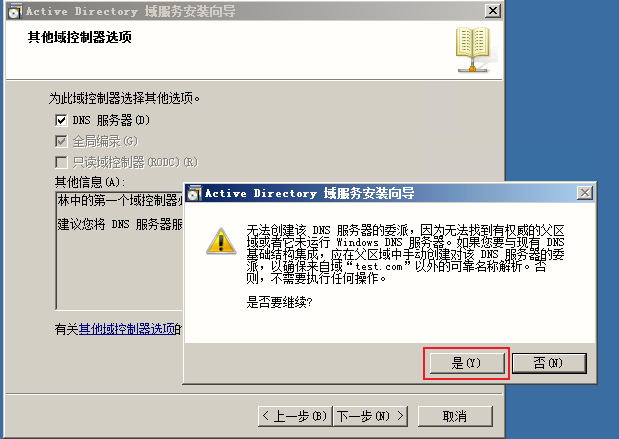
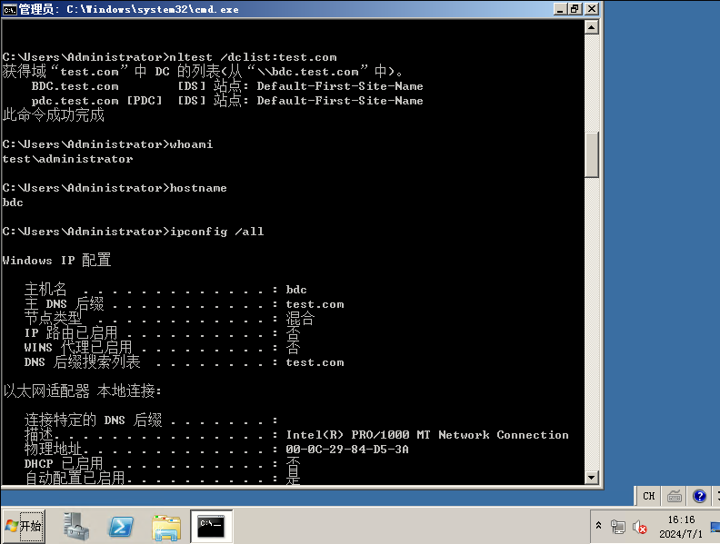

# AD域


**域架构: 主从域**

| 主机名            | IP           | 角色     |
| ----------------- | ------------ | -------- |
| pdc.test.com      | 172.168.2.61 | PDC      |
| bdc.test.com      | 172.168.2.62 | BDC      |
| client01.test.com | 172.168.2.65 | client01 |
| client02.test.com | 172.168.2.66 | client02 |


## 1. 安装PDC


### 1.1 配置网络

```cmd
# 配置网络

# 查看接口索引
netsh interface ip show interface
netsh interface ip set address 11 static 172.168.2.61 255.255.255.0 172.168.2.254
netsh interface ip add dnsservers 11 127.0.0.1
# 启用接口
netsh interface set interface "本地连接" admin=enabled

# 关闭防火墙
netsh advfirewall show domainprofile
netsh advfirewall set allprofiles state off
```


### 1.2 安装第一台域控

```cmd
# 打开安装域控程序窗口
dcpromo
```





### 1.3 创建普通域用户


## 2. 客户端01


### 2.1 配置网络并加域


### 2.2 登录域用户并测试dns


### 2.3 PDC配置组策略


### 2.4 客户端01验证组策略

**强制刷新组策略并重启**

```cmd
gpupdate /force
shutdosn -r -t 0
```


## 3. 安装BDC


### 3.1 配置网络


### 3.2 安装第二台域控，为BDC角色


### 3.3 登录并配置BDC




### 3.4 查看BDC跟PDC同步的状态

**DNS**


**域对象**


**组策略**


**域和信任关系**


**站点和服务**


## 4. 客户端02


### 4.1 配置网络并加域


### 4.2 在BDC上创建普通域用户


### 4.3 登录域用户并测试dns


## 5. 模拟PDC故障，BDC升级为PDC-灾难恢复-方式一


### 5.1 模拟PDC故障

**将PDC关机**


**BDC已经无法ping通PDC了，表示PDC已经关机了**


### 5.2 BDC升级为PDC


**清除元数据，抢夺五大角色**

```cmd
C:\Users\Administrator>ntdsutil
ntdsutil: metadata cleanup
metadata cleanup: select operation target
select operation target: connections
server connections: connect to domain test.com
绑定到 \\bdc.test.com ...
用本登录的用户的凭证连接 \\bdc.test.com。
server connections: quit
select operation target: list sites
找到 1 站点
0 - CN=Default-First-Site-Name,CN=Sites,CN=Configuration,DC=test,DC=com
select operation target: select site 0
站点 - CN=Default-First-Site-Name,CN=Sites,CN=Configuration,DC=test,DC=com
没有当前域
没有当前服务器
当前的命名上下文
select operation target: list domains in site
找到 1 域
0 - DC=test,DC=com
select operation target: select domain 0
站点 - CN=Default-First-Site-Name,CN=Sites,CN=Configuration,DC=test,DC=com
域 - DC=test,DC=com
没有当前服务器
当前的命名上下文
select operation target: list servers for domain in site
找到 2 服务器
0 - CN=PDC,CN=Servers,CN=Default-First-Site-Name,CN=Sites,CN=Configuration,DC=test,DC=com
1 - CN=BDC,CN=Servers,CN=Default-First-Site-Name,CN=Sites,CN=Configuration,DC=test,DC=com
select operation target: select server 0
站点 - CN=Default-First-Site-Name,CN=Sites,CN=Configuration,DC=test,DC=com
域 - DC=test,DC=com
服务器 - CN=PDC,CN=Servers,CN=Default-First-Site-Name,CN=Sites,CN=Configuration,DC=test,DC=com
        DSA 对象 - CN=NTDS Settings,CN=PDC,CN=Servers,CN=Default-First-Site-Name,CN=Sites,CN=Configuration,DC=test,DC=com
        DNS 主机名称 - pdc.test.com
        计算机对象 - CN=PDC,OU=Domain Controllers,DC=test,DC=com
当前的命名上下文
select operation target: quit
metadata cleanup: remove selected server

```


### 5.3 删除PDC无用相关资源

**站点和服务**


**DNS**


### 5.4 客户端查看当前PDC主机

**客户端01**


**客户端02**


## 6. 手动转移五大角色


### 6.1 GUI方式转移


**注册"Active Directory架构"图形化界面**


### 6.2 CLI方式转移

```cmd
# 需要转移五大角色 PDC、RID master、schema master、naming master、infrastructure master
# 以下为转移pdc为例
C:\Users\Administrator>ntdsutil
ntdsutil: roles
fsmo maintenance: connections
server connections: connect to server "bdc.test.com"
绑定到 bdc.test.com ...
用本登录的用户的凭证连接 bdc.test.com。
server connections: quit
fsmo maintenance: transfer pdc
```


```cmd
ldap_modify_sW 错误 0x34(52 (不可用).
Ldap 扩展的错误消息为 000020AF: SvcErr: DSID-03210581, problem 5002 (UNAVAILABLE
), data 1722

返回的 Win32 错误为 0x20af(请求的 FSMO 操作失败。不能连接当前的 FSMO 盒。)
)
根据错误代码这可能表示连接
ldap, 或角色传送错误。
服务器 "bdc.test.com" 知道有关 5 作用
架构 - CN=NTDS Settings,CN=PDC,CN=Servers,CN=Default-First-Site-Name,CN=Sites,CN
=Configuration,DC=test,DC=com
命名主机 - CN=NTDS Settings,CN=PDC,CN=Servers,CN=Default-First-Site-Name,CN=Site
s,CN=Configuration,DC=test,DC=com
PDC - CN=NTDS Settings,CN=PDC,CN=Servers,CN=Default-First-Site-Name,CN=Sites,CN=
Configuration,DC=test,DC=com
RID - CN=NTDS Settings,CN=PDC,CN=Servers,CN=Default-First-Site-Name,CN=Sites,CN=
Configuration,DC=test,DC=com
结构 - CN=NTDS Settings,CN=PDC,CN=Servers,CN=Default-First-Site-Name,CN=Sites,CN
=Configuration,DC=test,DC=com
fsmo maintenance:
```

> 错误原因：因为PDC已经关机不在线，所以转移不成功，PDC不变，如图


## 7. 手动抢夺五大角色-灾难恢复-方式二

**方式一删除不干净，用此方式二次删除，可以抢夺五大角色**

```bash
C:\Users\Administrator>ntdsutil
ntdsutil: roles
fsmo maintenance: connections
server connections: connect to server "bdc.test.com"
绑定到 bdc.test.com ...
用本登录的用户的凭证连接 bdc.test.com。
server connections: quit

# 占用 RID 主机角色
seize RID master
# 占用 PDC 模拟器角色
seize PDC
# 占用结构主机角色
seize infrastructure master
# 占用域命名主机角色
seize domain naming master
# 占用架构主机角色
seize schema master
```

> **此方式抢夺五大角色后，重启机器如果提示此域不存在，原因是其它域控服务器DNS地址未填写新PDC服务器的IP地址，所以造成通信交互失败**

