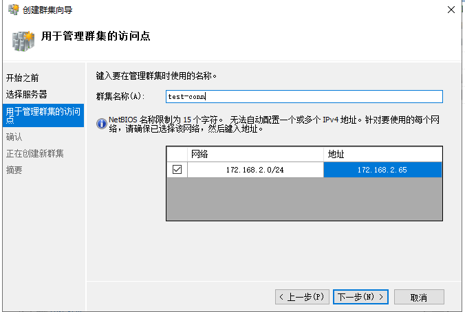
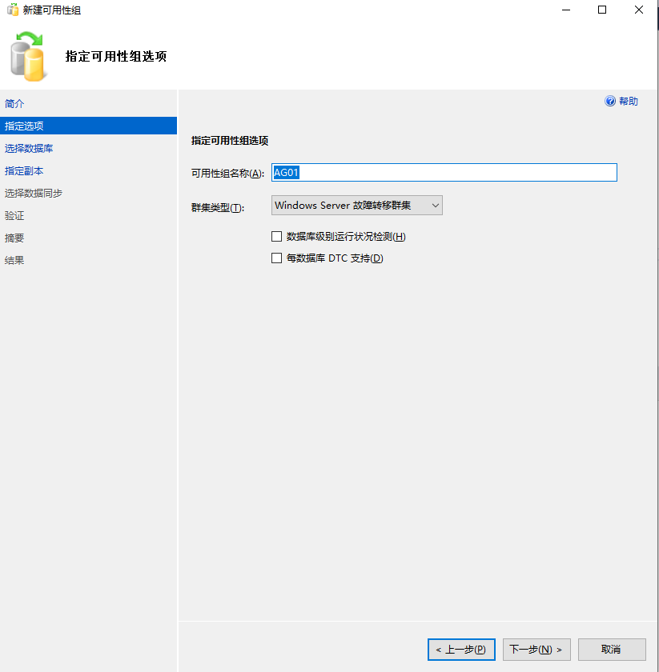
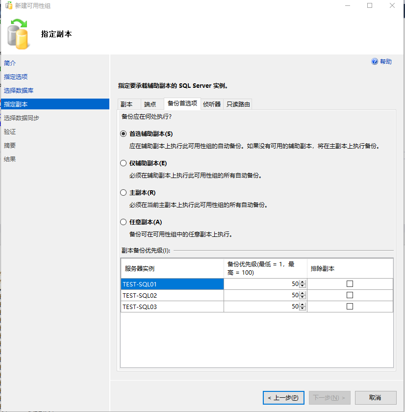
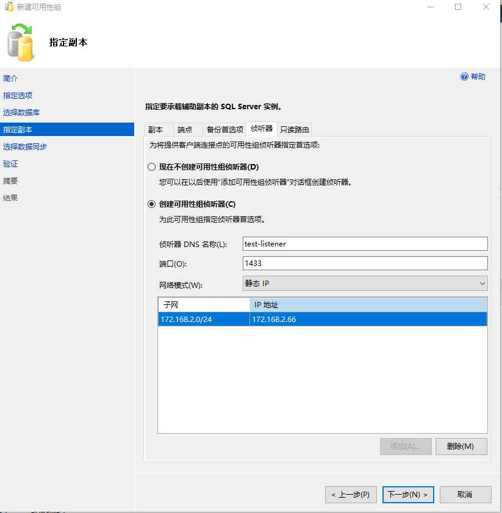
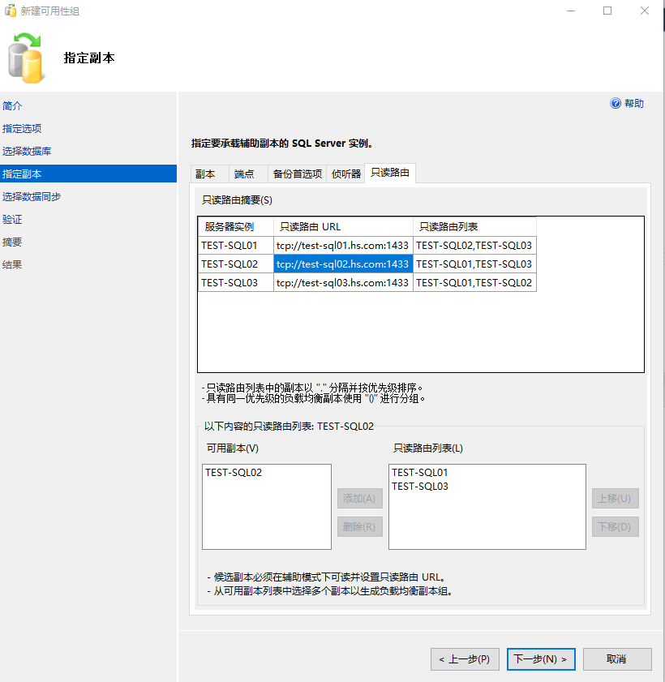

# SQLServer 2016 Always-On Cluster Deploy


## 环境

* server01: 
  * os: windows server 2019 datacenter
  * sqlserver: 2016 enterprise
  * hostname: test-sql01
  * ip: 172.168.2.62
* server02: 

  * os: windows server 2019 datacenter

  * sqlserver: 2016 enterprise
  * hostname: test-sql02
  * ip: 172.168.2.63
* server03: 

  * os: windows server 2019 datacenter

  * sqlserver: 2016 enterprise
  * hostname: test-sql03
  * ip: 172.168.2.64
* WSFC集群
  * hostname: test-conn
  * ip: 172.168.2.65 
  * 仲裁见证
    * 文件共享仲裁：'\\\172.168.2.122\sql-share'
* SQLServer 2016 可用组Listener
  * hostname: test-listener
  * ip: 172.168.2.66

* 用户
  * hs\testsql: 登录服务器用户
  * hs\testsqlserver: sqlserver服务、sqlserver代理 启动用户


### 1. 系统部署

---

* 安装windows server 2019 datacenter操作系统
* 配置ip地址、主机名、加域
* hs\testsql登入系统，此用户已加入到domain admins组中，此用户需要域管理员权限，因为在使用WSFC时需要在AD中创建对象，否则创建群集将会失败


### 2. 安装与配置故障转移集群管理器

---

* 服务器管理器 --> 添加功能和角色 --> 添加功能 --> "故障转移群集"，test-sql01、test-sql02、test-sql03三个节点都需要安装，安装完成生重启服务器生效

* 配置故障转移集群管理器，新建一个群集，将test-sql01、test-sql02、test-sql03三个服务器节点加入集群

  




注：此图报错，原因为hs\testsql用户未有创建AD中对象的权限，所以报错，需要将此用户加入到"domain admins"中，从而有创建对象的权限


注：此图为已成功创建群集截图


* URL: [了解 Azure Stack HCI 和 Windows Server 群集上的群集和池仲裁 - Azure Stack HCI | Microsoft Learn](https://learn.microsoft.com/zh-cn/azure-stack/hci/concepts/quorum)


* 配置仲裁，我们有3个节点，可以承受一个节点故障，但是第二次节点再故障将会脑残，为了可以容忍二次节点故障，可以配置仲裁，这样就可以容忍二次节点故障了，就是图上的："3个 + 见证"，为了方便，我们这里面配置"共享仲裁"

  

  

  

  


### 3. 安装sqlserver 2016

---

* 每台节点正常安装sqlserver 2016 enterprise实例，是单实例安装，不是集群模式安装
* 安装前关闭windows防火墙
* "数据库引擎服务" --> "针对外部数据的Polybase查询服务"、"R服务(数据库内)", "analysis services"、"reporting services"不要勾选，"共享功能" --> "R Server(独立)"、"Reporting Services - SharePoint"、"用于SharePoint产品的Reporting Service外接程序"、"Distributed Replay控制器"、"Distributed Replay客户端" 、其它勾选安装
* 身份验证模式为：混合模式，添加当前用户hs\testsql 为 sqlserver管理员 
* 所有节点的sqlserver安装，数据目录为"C:\SQL-DATA\"
* 安装完成后，安装SSMS客户端，需要单独下载安装才行，SSMS安装完成后重启服务器
* 每个节点安装好后需要为 MSSQLSERVER实例服务、SQLServer代理服务 配置当前专用管理员帐户(hs\testsqlserver)进行登录、配置服务自动启动，并重启服务，使2个服务有管理员权限


### 4. 开启AlwaysOn高可用功能

* 3个节点都需要启用AlwaysOn可用性组功能，并重启sqlserver服务生效


### 5. 配置AlwaysOn

* 配置AlwaysOn可用性组前，需要先完全备份将要运行在always-on分布式集群中的数据库，例如ReportDB数据库("ReportDB_20221002020001_full.bak")

  * 在主要服务器上恢复数据库，主要数据库必须是RCOVERY状态，哪台恢复，哪台就是主要数据库
  
  
  
  
  
  


* 在建可用性组之前：在集群名称“TEST-CONN“计算机所在的OU上，“TEST-CONN" 需要有 “读取所有对象"、“创建计算机对象”的权限


* 在AlwaysOn高可用性菜单上右键选择  --> "新建可用性组向导"

* 配置一个可用性组名称"AG01"，群集类型是 "Windows Server故障转移群集"

  

  









##### 注：

* 首选项为"自动种子设定"，要求所有同一可用性组中的每个SQL Server实例上的数据和日志文件路径都是相同的，我的数据目录为：C:\SQL-DATA，所以数据路径为：C:\SQL-DATA\MSSQL13.MSSQLSERVER\MSSQL\DATA\，日志路径为：C:\SQL-DATA\MSSQL13.MSSQLSERVER\MSSQL\DATA\
* 只读路由URL: TCP://test-sql01.hs.com:1433
* 只读路由列表：只有将节点配置为”可读辅助副本“时，才能配置”只读路由列表“


### 测试

```sql
-- select * from sys.dm_hadr_cluster_members
member_name	member_type	member_type_desc	member_state	member_state_desc	number_of_quorum_votes
test-sql03	0	CLUSTER_NODE	1	UP	1
test-sql02	0	CLUSTER_NODE	1	UP	1
test-sql01	0	CLUSTER_NODE	1	UP	1
文件共享见证	2	FILE_SHARE_WITNESS	1	UP	1

-- select * from sys.dm_hadr_cluster
cluster_name	quorum_type	quorum_type_desc	quorum_state	quorum_state_desc
test-conn	2	NODE_AND_FILE_SHARE_MAJORITY	1	NORMAL_QUORUM


-- SELECT @@SERVERNAME as HOSTNAME
HOSTNAME
TEST-SQL02

-- select host_name() as CLIENT_HOSTNAME
CLIENT_HOSTNAME
HS-UA-TSJ-0132


-- sql测试语句
create table dbo.users(
id nchar(10),
name nvarchar(50),
age tinyint
)

select * from dbo.users;

insert into dbo.users values ('1','jack',28);
```


### 手动故障转换

* 连接test-listener，在"Always On高可用性" --> "可用性组" --> "指定可用性组" <-- "右键故障转移，选择节点进行转移"
* 在辅助节点上，在“Always On高可用性” --> "可用性组" --> "指定可用性组" <-- "右键故障转移，选择本辅助节点为主节点进行转移"


### 自动故障转移

* 在WSFC"故障转移群集管理器"上，选择test-conn.hs.com集群下的角色，选中特定可用性组，右键属性，进行配置自动故障转移条件，切换到故障转换选项卡，默认条件是6小时内最大故障次数为2次，则立即自故障故障转移。
* 为了测试，所以我将自动故障转移条件配置为默认条件是6小时内最大故障次数为100次，则立即自故障故障转移。


### 总结

* 至此，3节点 + 文件共享仲裁的见证 WSFC集群已经配置完成
* 以上集群可以承载2次节点故障。
* 如果未配置见证，则只可以承载1次节点故障。


## 还原操作


### 小数据库文件备份还原操作

* 可以直接在主要数据库上直接还原即可
* 其它辅助数据库会同步主要数据库的数据文件


### 大数据库文件备份还原操作

```sql
-- 主要数据库
use master
go

create database HotelDB
go
-- RESTORE FILELISTONLY FROM DISK = N'C:\software\HotelDB_20221127020001_full.bak'

RESTORE DATABASE HotelDB
FROM
DISK='C:\software\HotelDB_20221127020001_full.bak'
WITH MOVE 'Homsom.Hotel.Elong' TO 'C:\SQL-DATA\MSSQL13.MSSQLSERVER\MSSQL\DATA\HotelDB.mdf',
MOVE 'Homsom.Hotel.Elong_log' TO 'C:\SQL-DATA\MSSQL13.MSSQLSERVER\MSSQL\DATA\HotelDB_log.ldf',
STATS = 10, REPLACE,RECOVERY
GO


-- 辅助数据库1
use master
go

create database HotelDB
go
-- RESTORE FILELISTONLY FROM DISK = N'C:\software\HotelDB_20221127020001_full.bak'

RESTORE DATABASE HotelDB
FROM
DISK='C:\software\HotelDB_20221127020001_full.bak'
WITH MOVE 'Homsom.Hotel.Elong' TO 'C:\SQL-DATA\MSSQL13.MSSQLSERVER\MSSQL\DATA\HotelDB.mdf',
MOVE 'Homsom.Hotel.Elong_log' TO 'C:\SQL-DATA\MSSQL13.MSSQLSERVER\MSSQL\DATA\HotelDB_log.ldf',
STATS = 10, REPLACE,NORECOVERY
GO


-- 辅助数据库2
use master
go

create database HotelDB
go
-- RESTORE FILELISTONLY FROM DISK = N'C:\software\HotelDB_20221127020001_full.bak'

RESTORE DATABASE HotelDB
FROM
DISK='C:\software\HotelDB_20221127020001_full.bak'
WITH MOVE 'Homsom.Hotel.Elong' TO 'C:\SQL-DATA\MSSQL13.MSSQLSERVER\MSSQL\DATA\HotelDB.mdf',
MOVE 'Homsom.Hotel.Elong_log' TO 'C:\SQL-DATA\MSSQL13.MSSQLSERVER\MSSQL\DATA\HotelDB_log.ldf',
STATS = 10, REPLACE,NORECOVERY
GO
```

* 然后在主要数据库上添加数据库 --> 全部连接 --> 选择恢复的数据库 --> "选择您的数据库同步选项" --> "仅联接" --> "直至完成即可"
