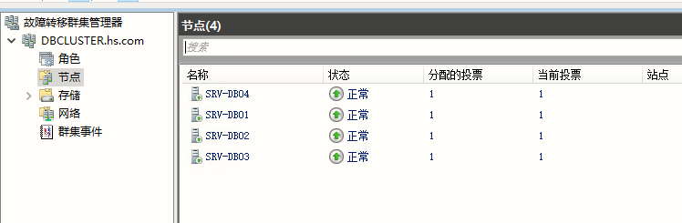
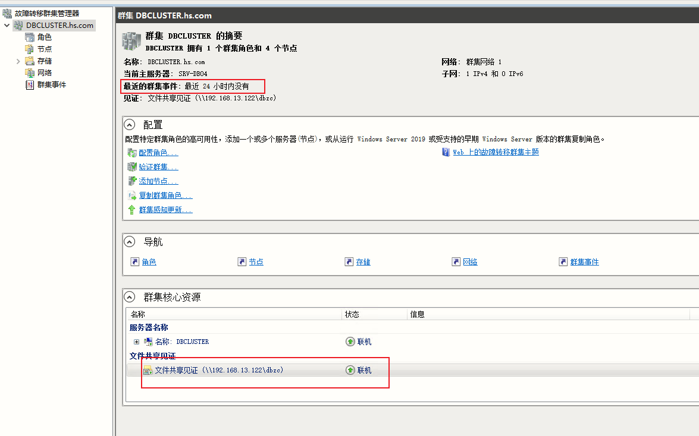

# 主机相关信息

* SRV-DB01: 192.168.13.131
* SRV-DB02: 192.168.13.132
* SRV-DB03: 192.168.13.133
* DBCLUSTER: 192.168.13.134    		# WSFC侦听器名称及地址
* `\\192.168.13.122\dbzc`			     # 文件共享仲裁
* DBCONN: 192.168.13.135


# 用户信息

* 登录用户：hs\dbadmin   		角色: `hs\domain admins`
* sqlserver用户：hs\dbadmin		角色: `hs\domain admins`


# 部署

## 1. 加域

1. 配置网络
2. 配置主机名及加域
3. 用hs\dbadmin用户登录服务器


## 2. 安装更新

1. 配置wsus配置
2. 安装更新到最新补丁
3. windows server 2019安装更新失败报`0x8024401c`错误时，可使用如下办法解决
```
net stop wuauserv
reg delete HKEY_LOCAL_MACHINE\SOFTWARE\Policies\Microsoft\Windows\WindowsUpdate /f
net start wuauserv
```
4. 如果wsus更新安装不了，则使用系统默认的更新服务器安装


## 3. 安装WSFC群集

1. 服务器管理器 --> 添加功能和角色 --> 添加功能 --> "故障转移群集"，SRV-DB01、SRV-DB02、SRV-DB03三个节点都需要安装，安装完成后重启服务器生效

2. 配置故障转移集群管理器，新建一个群集
	* 将SRV-DB01、SRV-DB02、SRV-DB03三个服务器节点加入群集
	* 运行群集测试
	* 配置群集名称：DBCLUSTER，群集地址：192.168.13.134
	* 去除 "将所有符合条件的存储添加到群集" 复选框
	
3. 配置仲裁，我们有3个节点，可以承受一个节点故障，但是第二次节点再故障将会脑裂，为了可以容忍二次节点故障，可以配置仲裁，这样就可以容忍二次节点故障了。
	* 配置文件共享仲裁
	
	* 因为是DBCLUSTER群集去读写仲裁，所以需要将在文件共享中给予`DBCLUSTER`计算机用户读写权限、本地管理员administrators权限
	
	  ```powershell
	  # 文件共享仲裁应配置为Name的值，权限为读写，这里面为计算机DBCLUSTER$
	  PS C:\Users\dbadmin> Get-Cluster | Select-Object Name, Domain
	  
	  Name      Domain
	  ----      ------
	  DBCLUSTER hs.com
	  ```
	
	  


## 4. 安装SQLServer 2016

1. 安装前关闭windows防火墙
2. 每台节点正常安装sqlserver 2016 enterprise实例，是单实例安装，不是集群模式安装
3. 安装与不安装特定服务
	* "数据库引擎服务" --> "针对外部数据的Polybase查询服务"、"R服务(数据库内)", "analysis services"、"reporting services"不要勾选安装、
	* "共享功能" --> "R Server(独立)"、"Reporting Services - SharePoint"、"用于SharePoint产品的Reporting Service外接程序"、"Distributed Replay控制器"、"Distributed Replay客户端" 不要勾选安装
	* 其它勾选安装
4. 身份验证模式为：混合模式，添加当前用户hs\dbadmin 为 sqlserver管理员 
5. 所有节点的sqlserver安装，数据目录为"D:\DBDATA\"
6. 安装完成后，安装SSMS客户端，需要单独下载安装才行，SSMS安装完成后重启服务器
7. 每个节点安装好后需要为 MSSQLSERVER实例服务、SQLServer代理服务 配置当前专用管理员帐户(hs\dbadmin)进行登录、配置服务自动启动，并重启服务，使2个服务有管理员权限


## 5. 开启AlwaysOn高可用功能

3个节点`SQL Server(MSSQLSERVER)`都需要启用AlwaysOn可用性组功能，并重启sqlserver服务生效


## 6. 配置AlwaysOn

1. 在建可用性组之前：在集群名称`DBCLUSTER`计算机所在的OU上，`DBCLUSTER` 需要有 `读取所有对象`(默认就有读取所有对象权限，此权限可不更改)、`创建计算机对象`(需要添加此权限)的权限
2. 配置AlwaysOn可用性组前，需要先完全备份将要运行在Always On分布式集群中的数据库
	* 例如ReportDB数据库("RankDB_full.bak")，在主要服务器上恢复数据库，主要数据库必须是RCOVERY状态，哪台恢复，哪台就是主要数据库
3. 在AlwaysOn高可用性菜单上右键选择  --> "新建可用性组向导"，配置一个可用性组名称`DBCONN`，群集类型是 "Windows Server故障转移群集"
4. 添加副本、配置备份首选项、配置侦听器名称为：`DBCONN`，侦听器IP为：192.168.13.135
5. 选择数据同步为`仅联接`，前提是已经在所有辅助副本还原过数据库
6. 可用性组添加完成


## 7. 节点故障恢复

`注：此步骤为故障恢复，步骤时可跳过`
1. WSFC群集逐出故障节点
2. 故障节点重装系统、安装更新、安装WSFC、安装SQLServer 2016、安装SQLServer客户端
3. 打开WSFC群集管理器将新节点加入WSFC群集
4. 在正常AlwaysOn集群任意一节点，完全备份`所有正在使用的数据库`、并将备份数据复制到新节点上进行恢复，恢复状态必须为`NORECOVERY`状态
5. 在AlwaysOn可用性组中添加副本，此副本为新部署的SQLServer节点、选择数据同步为`仅联接`


## 8. 配置只读路由

1. 在AlwaysOn可用性组`DBCONN`上打开属性配置框，选择左边只读路由 
2. 配置服务器实例对应的`只读路由URL`
	* SRV-DB01: `TCP://SRV-DB01.hs.com:1433`
	* SRV-DB02: `TCP://SRV-DB02.hs.com:1433`
	* SRV-DB03: `TCP://SRV-DB03.hs.com:1433`
3. 配置服务器实例对应的`只读路由列表`
	* SRV-DB01: `SRV-DB02,SRV-DB03`
	* SRV-DB02: `SRV-DB01,SRV-DB03`
	* SRV-DB03: `SRV-DB01,SRV-DB02`
	* 如果需要使2个辅助副本具有同样的优先级，可以选中2个副本(按`Ctrl键`点选多个)，再点`添加`，则为SRV-DB01: `(SRV-DB02,SRV-DB03)`
4. 配置完成后，进行测试即可
5. 配置出错插曲
	* 当时只有2个数据库节点，配置只读路由列表时报错
	* 于是增加了1个数据库节点，形成3个节点，配置只读路由列表还是报错
	* 于是手动故障转移`主要节点`到新节点
	* 再配置只读路由列表成功
	* 创建第二个可用性组时也报错，解决方法是先填写`只读路由URL`并先保存，然后再编辑`只读路由列表`保存即可
	
```sql
---查询可用性副本信息
SELECT * FROM master.sys.availability_replicas

---建立read指针 - 在当前的primary上为每个副本建立副本对于的tcp连接
ALTER AVAILABILITY GROUP [DBCONN]
MODIFY REPLICA ON
N'SRV-DB01' WITH
(SECONDARY_ROLE (READ_ONLY_ROUTING_URL = N'TCP://SRV-DB01.hs.com:1433'))

ALTER AVAILABILITY GROUP [DBCONN]
MODIFY REPLICA ON
N'SRV-DB02' WITH
(SECONDARY_ROLE (READ_ONLY_ROUTING_URL = N'TCP://SRV-DB02.hs.com:1433'))

ALTER AVAILABILITY GROUP [DBCONN]
MODIFY REPLICA ON
N'SRV-DB03' WITH
(SECONDARY_ROLE (READ_ONLY_ROUTING_URL = N'TCP://SRV-DB03.hs.com:1433'))


----为每个可能的primary role配置对应的只读路由副本
--list列表有优先级关系，排在前面的具有更高的优先级,当db02正常时只读路由只能到db02，如果db02故障了只读路由才能路由到DB03
ALTER AVAILABILITY GROUP [DBCONN]
MODIFY REPLICA ON
N'SRV-DB01' WITH
(PRIMARY_ROLE (READ_ONLY_ROUTING_LIST=(('SRV-DB02','SRV-DB03'))));	--同一优先级使用()表示，默认优先级是以顺序来确定

ALTER AVAILABILITY GROUP [DBCONN]
MODIFY REPLICA ON
N'SRV-DB02' WITH
(PRIMARY_ROLE (READ_ONLY_ROUTING_LIST=('SRV-DB01','SRV-DB03')));

ALTER AVAILABILITY GROUP [DBCONN]
MODIFY REPLICA ON
N'SRV-DB03' WITH
(PRIMARY_ROLE (READ_ONLY_ROUTING_LIST=('SRV-DB01','SRV-DB02')));


--查询优先级关系
SELECT  ar.replica_server_name ,
        rl.routing_priority ,
        ( SELECT    ar2.replica_server_name
          FROM      sys.availability_read_only_routing_lists rl2
                    JOIN sys.availability_replicas AS ar2 ON rl2.read_only_replica_id = ar2.replica_id
          WHERE     rl.replica_id = rl2.replica_id
                    AND rl.routing_priority = rl2.routing_priority
                    AND rl.read_only_replica_id = rl2.read_only_replica_id
        ) AS 'read_only_replica_server_name'
FROM    sys.availability_read_only_routing_lists rl
        JOIN sys.availability_replicas AS ar ON rl.replica_id = ar.replica_id
```


## 9. 配置多网口

1. 可以在每个节点上增加多网口，例如每个节点再增加1个网口，并配置IP网关等信息，确保每个网口可正常上网
2. 在WSFC群集中`验证集群`，此时不会报网络单点故障的警告了
3. 当WSFC群集检测到网络后，只读路由中的`只读路由URL`域名自动会指向多个IP的A记录
```
> srv-db02.hs.com
服务器:  homsom-dc01.hs.com
Address:  192.168.10.250

名称:    srv-db02.hs.com
Addresses:  192.168.13.132
          192.168.13.137
```
4. DBCONN是在某个物理接口之上进行监听工作的，所以当这个物理接口故障后，可用性组侦听器IP则会闪断飘移到本机另外一个接口，如果本机接口都故障，则会飘移到其它节点接口


## 10. 程序配置读写和只读

```
---C# 连接字符串
server=侦听IP;database=;uid=;pwd=;ApplicationIntent=ReadOnly

---ssms：其它连接参数
--仅意向读连接
ApplicationIntent=ReadOnly
--读写连接
ApplicationIntent=ReadWrite
```


​	

## 11. 创建第个二可用性组DBCONNLOG


1. 在`数据库服务器上`创建新数据库`Test02`

```sql
CREATE DATABASE [Test02] 
ON PRIMARY
(
NAME = N'Test02',
FILENAME = N'D:\SQLData\Test02.mdf',
SIZE = 8192KB,
FILEGROWTH = 65536KB,
MAXSIZE = UNLIMITED
)
LOG ON
(
NAME = N'Test02_log',
FILENAME = N'D:\SQLData\Test02_log.ldf',
SIZE = 8192KB,
FILEGROWTH = 65536KB,
MAXSIZE = 2048GB
)
GO
```

2. 完全备份`空的`数据库`Test02`

```sql
BACKUP DATABASE [Test02] TO DISK=N'd:\dbbackup\test02'  
WITH NOFORMAT ,NOINIT,  NAME = N'test-完整 数据库 备份', SKIP, NOREWIND, NOUNLOAD,  STATS = 10  
```

3. 创建可用性组，`数据同步首选项`选择`自动种子设定`，此时会自动备份还原新的数据库到其它辅助数据库，前提是所有数据库实例的DATA目录`D:\SQLData`路径必须一样
`注：不建议使用第3步 自动种子设定 ，因为经过测试，有些节点的数据库并没有创建，从而可用性组中的某些数据库并没有完成同步，只能采用第4步的步骤进行修复`


4. 新建数据库添加可用性组建议
- 批处理脚本新建数据库
- 批处理脚本备份新建数据库
- 复制备份数据库到其它节点同样的备份目录中
- 其它节点批处理脚本恢复数据库，恢复模式必须为NORECOVERY
- 在主要数据库可用性组中添加`可用性数据库`，可使用`Shift`键进行多选，并用`空格`进行选择


## 12. golang生成数据库脚本

```go
/*
connlog需要每年底创建下一年数据库，此脚本用于生成创建和删除数据库SQL命令
此文件具备AlwaysOn集群新建数据库及全备的脚本生成功能
*/
package main

import (
	"fmt"
	"sort"
)

type Month int

const (
	YEAR   int    = 2023
	Prefix string = "Log"
)

const (
	January Month = iota + 1
	February
	March
	April
	May
	June
	July
	August
	September
	October
	November
	December
)

var (
	d               = 1
	Slist           = []string{}
	DATA_DIR        = "D:\\SQLData"
	SIZE            = "8192KB"
	FILEGROWTH      = "65536KB"
	PRIMARY_MAXSIZE = "UNLIMITED"
	LOG_MAXSIZE     = "2048GB"
	BACKUP_DIR      = "D:\\tmp"
)

// 判断是否为润年，润年2月29天，非润年2月28天
func IsRunNian(year int) bool {
	if year > 0 {
		result := year % 4
		if result == 0 {
			return true
		} else {
			return false
		}
	} else {
		panic("[ERROR]: 年份不合法")
	}
}

// 输出大小月日期
func OutputDate() {
	MaxMonthList := [7]Month{January, March, May, July, August, October, December}
	MinMonthList := [4]Month{April, June, September, November}
	for _, v := range MaxMonthList {
		if v < October {
			Slist = append(Slist, fmt.Sprintf("%s%d%s%d%s%d", Prefix, YEAR, "0", v, "0", d))
			Slist = append(Slist, fmt.Sprintf("%s%d%s%d%d", Prefix, YEAR, "0", v, d+10))
			Slist = append(Slist, fmt.Sprintf("%s%d%s%d%d", Prefix, YEAR, "0", v, d+20))
			Slist = append(Slist, fmt.Sprintf("%s%d%s%d%d", Prefix, YEAR, "0", v, d+30))
		} else {
			Slist = append(Slist, fmt.Sprintf("%s%d%d%s%d", Prefix, YEAR, v, "0", d))
			Slist = append(Slist, fmt.Sprintf("%s%d%d%d", Prefix, YEAR, v, d+10))
			Slist = append(Slist, fmt.Sprintf("%s%d%d%d", Prefix, YEAR, v, d+20))
			Slist = append(Slist, fmt.Sprintf("%s%d%d%d", Prefix, YEAR, v, d+30))
		}
	}
	for _, v := range MinMonthList {
		if v < November {
			Slist = append(Slist, fmt.Sprintf("%s%d%s%d%s%d", Prefix, YEAR, "0", v, "0", d))
			Slist = append(Slist, fmt.Sprintf("%s%d%s%d%d", Prefix, YEAR, "0", v, d+10))
			Slist = append(Slist, fmt.Sprintf("%s%d%s%d%d", Prefix, YEAR, "0", v, d+20))
			Slist = append(Slist, fmt.Sprintf("%s%d%s%d%d", Prefix, YEAR, "0", v, d+29))
		} else {
			Slist = append(Slist, fmt.Sprintf("%s%d%d%s%d", Prefix, YEAR, v, "0", d))
			Slist = append(Slist, fmt.Sprintf("%s%d%d%d", Prefix, YEAR, v, d+10))
			Slist = append(Slist, fmt.Sprintf("%s%d%d%d", Prefix, YEAR, v, d+20))
			Slist = append(Slist, fmt.Sprintf("%s%d%d%d", Prefix, YEAR, v, d+29))
		}
	}
}

// 加入2月日期
func GenDate(b bool) {
	if b {
		//润年，2月29天
		OutputDate()
		Slist = append(Slist, fmt.Sprintf("%s%d%s%d%s%d", Prefix, YEAR, "0", February, "0", d))
		Slist = append(Slist, fmt.Sprintf("%s%d%s%d%d", Prefix, YEAR, "0", February, d+10))
		Slist = append(Slist, fmt.Sprintf("%s%d%s%d%d", Prefix, YEAR, "0", February, d+20))
		Slist = append(Slist, fmt.Sprintf("%s%d%s%d%d", Prefix, YEAR, "0", February, d+28))
	} else {
		//非润年，2月28天
		OutputDate()
		Slist = append(Slist, fmt.Sprintf("%s%d%s%d%s%d", Prefix, YEAR, "0", February, "0", d))
		Slist = append(Slist, fmt.Sprintf("%s%d%s%d%d", Prefix, YEAR, "0", February, d+10))
		Slist = append(Slist, fmt.Sprintf("%s%d%s%d%d", Prefix, YEAR, "0", February, d+20))
		Slist = append(Slist, fmt.Sprintf("%s%d%s%d%d", Prefix, YEAR, "0", February, d+27))
	}
}

func AlwaysOnClusterCreateDB() {
	// 生成新建数据库脚本
	fmt.Println("---- AlwaysOn集群创建数据库")
	for _, v := range Slist {
		fmt.Printf("-- %s\n", v)
		fmt.Printf("CREATE DATABASE %s\nON PRIMARY\n(\nNAME = N'%s',\nFILENAME = N'%s\\%s.mdf',\nSIZE = %s,\nFILEGROWTH = %s,\nMAXSIZE = %s\n)\nLOG ON\n(\nNAME = N'%s_log',\nFILENAME = N'%s\\%s_log.ldf',\nSIZE = %s,\nFILEGROWTH = %s,\nMAXSIZE = %s\n)\nGO\n",
			v, v, DATA_DIR, v, SIZE, FILEGROWTH, PRIMARY_MAXSIZE, v, DATA_DIR, v, SIZE, FILEGROWTH, LOG_MAXSIZE)
		fmt.Println()
	}

	// 生成完全备份数据库脚本
	fmt.Println("---- AlwaysOn集群完全备份数据库")
	for _, v := range Slist {
		fmt.Printf("-- %s\n", v)
		fmt.Printf("BACKUP DATABASE [%s] TO DISK=N'%s\\%s_full.bak'\nWITH NOFORMAT, NOINIT, NAME=N'%s-完整 数据库 备份', SKIP, NOREWIND, NOUNLOAD, STATS=10\n", v, BACKUP_DIR, v, v)
		fmt.Println()
	}

	// 生成恢复数据库脚本-RECOVERY
	fmt.Println("---- AlwaysOn集群恢复数据库-RECOVERY")
	for _, v := range Slist {
		fmt.Printf("-- %s\n", v)
		fmt.Printf("RESTORE DATABASE [%s]\nFROM\nDISK=N'%s\\%s_full.bak'\nWITH MOVE '%s' TO N'%s\\%s.mdf',\nMOVE '%s_log' TO N'%s\\%s_log.ldf',\nSTATS = 10, REPLACE,RECOVERY\nGO\n",
			v, BACKUP_DIR, v, v, DATA_DIR, v, v, DATA_DIR, v)
		fmt.Println()
	}

	// 生成恢复数据库脚本-NORECOVERY
	fmt.Println("---- AlwaysOn集群恢复数据库-NORECOVERY")
	for _, v := range Slist {
		fmt.Printf("-- %s\n", v)
		fmt.Printf("RESTORE DATABASE [%s]\nFROM\nDISK=N'%s\\%s_full.bak'\nWITH MOVE '%s' TO N'%s\\%s.mdf',\nMOVE '%s_log' TO N'%s\\%s_log.ldf',\nSTATS = 10, REPLACE,NORECOVERY\nGO\n",
			v, BACKUP_DIR, v, v, DATA_DIR, v, v, DATA_DIR, v)
		fmt.Println()
	}

}

func CreateDBStatement() {
	for _, v := range Slist {
		fmt.Printf("CREATE DATABASE %s\n", v)
	}
}

func DropDBStatement() {
	for _, v := range Slist {
		fmt.Printf("DROP DATABASE %s\n", v)
	}
}

func main() {
	result := IsRunNian(YEAR)
	GenDate(result)

	// 对slice进行排序
	sort.Strings(Slist)

	fmt.Println("-------- AlwaysOn集群创建数据库和完全备份语句")
	AlwaysOnClusterCreateDB()

	// fmt.Println("-- 创建数据库语句")
	// CreateDBStatement()

	// fmt.Println("-- 删除数据库语句")
	// DropDBStatement()
}

```


## 13. 故障转移

在`SRV-DB01、SRV-DB02、SRV-DB03`基础上增加了一台`SRV-DB04`机器，用于备份数据，不进行业务流量接入，信息如下：

```
SRV-DB04	192.168.13.140
```

在执行故障转移时，同步节点往同步节点转移不会提示`数据丢失警告`，只有同步节点往异步节点 `或 ` 异步节点往同步节点进行同步时才会提示`数据丢失警告`,如果坚持这样做了，然后再切换回去，此时只读副本会有问题，需要在`Always On高可用性 --> 可用性组 --> DBCONN --> 可用性数据库`上对所有数据库一一右键进行`恢复数据移动`才行。


## 14. 数据库恢复

1. 还原数据库到主数据库，还原状态为`RECOVERY`，如果`.ldf`文件比较大，则需要先对数据库进行收缩，否则其它节点恢复数据库时无法`联接`成功，，收缩SQL如下：

```sql
USE testDB;
ALTER DATABASE [testDB] SET RECOVERY SIMPLE;

DBCC SHRINKDATABASE(testDB)

ALTER DATABASE [testDB] SET RECOVERY FULL;
```

2. 全备主要数据库节点的数据库`testDB`，然后分发数据库到其它辅助节点进行恢复，辅助数据库节点恢复数据库状态必需为`NORECOVERY`
3. 然后在相应`可用性组`中进行`添加数据库`进行数据库`联接`，实现可用性数据库功能。


## 15.添加数据库节点

新节点信息

```
host: SRV-DB04
ip: 192.168.13.139
```


### 15.1 配置主机

1. 配置网络、关闭`Internet协议版本6（TCP/IPv6）`，协议版本跟其它节点保持一致
2. 配置主机名及加域
3. 用hs\dbadmin用户登录服务器、关闭防火墙
4. 安装更新


### 15.2 配置WSFC群集

1. 服务器管理器 --> 添加功能和角色 --> 添加功能 --> "故障转移群集"安装，安装完成后重启服务器生效。
2. 连接当前的群集`DBCLUSTER`
3. 在群集中选择`节点`-> 右键选择`添加节点 `-> `选择服务器` -> 输入服务器名称`SRV-DB04`并添加
4. 在`确认`菜单时，去除 "将所有符合条件的存储添加到群集" 复选框
5. 运行配置群集测试，看此节点是否符合群集要求，通过后点击`完成`
6. 此时在 `DBCLUSTER`群集下面 -> `节点`可看到新节点`SRV-DB04`，此时共有4个节点
7. 选择`DBCLUSTER`群集下面 -> 选择`角色 DBCONN` -> 右键`DBCONN`选择`属性`，配置自动故障转移的节点，因为`SRV-DB04`不用做业务接入，所以这里面`把此节点移至最后并不勾选此节点`。


### 15.3 安装SQLServer 2016

1. 单实例安装sqlserver 2016 enterprise，不是集群模式安装
2. 安装与不安装特定服务

* "数据库引擎服务" --> "针对外部数据的Polybase查询服务"、"R服务(数据库内)", "analysis services"、"reporting services"不要勾选安装、
* "共享功能" --> "R Server(独立)"、"Reporting Services - SharePoint"、"用于SharePoint产品的Reporting Service外接程序"、"Distributed Replay控制器"、"Distributed Replay客户端" 不要勾选安装
* 其它勾选安装
* 实例根目录、共享功能目录、共享功能目录(x86)路径：默认不变

1. 身份验证模式为：混合模式，添加当前用户hs\dbadmin 为 sqlserver管理员 
2. 数据目录为"D:\DBDATA\"
3. 安装完成后，安装SSMS客户端，需要单独下载安装才行，SSMS安装完成后重启服务器
4. 每个节点安装好后需要为 MSSQLSERVER实例服务、SQLServer代理服务 配置当前专用管理员帐户(hs\dbadmin)进行登录、配置服务自动启动，并重启服务，使2个服务有管理员权限


### 15.4 配置sqlserver

1. 配置本节点SQLServer内存限制，因为本机是32G，所以限制SQLServer使用内存为16G，路径：SSMS -> 连接本地SQLserver服务 -> 右键选择服务器属性 -> 内存进行配置
2. 启用AlwaysOn可用性组功能，打开`SQL Server配置管理器（本地）` -> `SQL Server服务` -> `SQL Server(MSSQLSERVER)` -> 右键选择`属性` -> 选择`AlwaysOn高可用性` -> 勾选`启用AlwaysOn可用性组`，并重启sqlserver服务生效
3. 打开`SQL Server配置管理器（本地）`，配置`SQL Server(MSSQLSERVER)`和`SQL Server(MSSQLSERVER)`开机自启动


### 15.5 恢复数据并联接到可用性组

在主节点全备需要的数据库，将备份好的数据库复制到此节点之上，然后进行恢复（恢复模式必须为`NORECOVERY`），然后在可用性组中联接此数据库

```sql

# 此节点恢复

-- FinanceDB_20250413023000_full.bak
USE master
GO
RESTORE DATABASE [FinanceDB] FROM DISK = N'C:\sqlserver-bak\FinanceDB_20250413023000_full.bak'
WITH FILE = 1,
MOVE N'FinanceDB' TO N'D:\SQLData\FinanceDB.mdf',  
MOVE N'FinanceDB_log' TO N'D:\SQLData\FinanceDB_log.ldf', 
NORECOVERY, NOUNLOAD, REPLACE, STATS = 10
GO

-- SkyWalkerDB_20250413023000_full.bak
USE master
GO
RESTORE DATABASE [SkyWalkerDB] FROM DISK = N'C:\sqlserver-bak\SkyWalkerDB_20250413023000_full.bak'
WITH FILE = 1,
MOVE N'SkyWalkerDB' TO N'D:\SQLData\SkyWalkerDB.mdf',  
MOVE N'SkyWalkerDB_log' TO N'D:\SQLData\SkyWalkerDB_log.ldf', 
NORECOVERY, NOUNLOAD, REPLACE, STATS = 10
GO


-- SkyWalkerDB_20250413023000_full.bak
USE master
GO
RESTORE DATABASE [SkyWalkerDB] FROM DISK = N'C:\sqlserver-bak\SkyWalkerDB_20250413023000_full.bak'
WITH FILE = 1,
MOVE N'SkyWalkerDB' TO N'D:\SQLData\SkyWalkerDB.mdf',  
MOVE N'SkyWalkerDB_log' TO N'D:\SQLData\SkyWalkerDB_log.ldf', 
NORECOVERY, NOUNLOAD, REPLACE, STATS = 10
GO


-- IntegralDB_20250413023000_full.bak
USE master
GO
RESTORE DATABASE [IntegralDB] FROM DISK = N'C:\sqlserver-bak\IntegralDB_20250413023000_full.bak'
WITH FILE = 1,
MOVE N'IntegralDB' TO N'D:\SQLData\IntegralDB.mdf',  
MOVE N'IntegralDB_log' TO N'D:\SQLData\IntegralDB_log.ldf', 
NORECOVERY, NOUNLOAD, REPLACE, STATS = 10
GO


-- CommonFormDB_20250413023000_full.bak
USE master
GO
RESTORE DATABASE [CommonFormDB] FROM DISK = N'C:\sqlserver-bak\CommonFormDB_20250413023000_full.bak'
WITH FILE = 1,
MOVE N'CommonFormDB' TO N'D:\SQLData\CommonFormDB.mdf',  
MOVE N'CommonFormDB_log' TO N'D:\SQLData\CommonFormDB_log.ldf', 
NORECOVERY, NOUNLOAD, REPLACE, STATS = 10
GO


-- TripDB_20250413023000_full.bak
USE master
GO
RESTORE DATABASE [TripDB] FROM DISK = N'C:\sqlserver-bak\TripDB_20250413023000_full.bak'
WITH FILE = 1,
MOVE N'TripDB' TO N'D:\SQLData\TripDB.mdf',  
MOVE N'TripDB_log' TO N'D:\SQLData\TripDB_log.ldf', 
NORECOVERY, NOUNLOAD, REPLACE, STATS = 10
GO


-- ehomsom_20250413023000_full.bak
USE master
GO
RESTORE DATABASE [ehomsom] FROM DISK = N'C:\sqlserver-bak\ehomsom_20250413023000_full.bak'
WITH FILE = 1,
MOVE N'ehomsom_Data' TO N'D:\SQLData\ehomsom.mdf',  
MOVE N'ehomsom_Log' TO N'D:\SQLData\ehomsom_log.ldf', 
NORECOVERY, NOUNLOAD, REPLACE, STATS = 10
GO


-- TMS_ReportDb_20250413023000_full.bak
USE master
GO
RESTORE DATABASE [TMS_ReportDb] FROM DISK = N'C:\sqlserver-bak\TMS_ReportDb_20250413023000_full.bak'
WITH FILE = 1,
MOVE N'TMS_ReportDb' TO N'D:\SQLData\TMS_ReportDb.mdf',  
MOVE N'TMS_ReportDb_log' TO N'D:\SQLData\TMS_ReportDb_log.ldf', 
NORECOVERY, NOUNLOAD, REPLACE, STATS = 10
GO


-- OpenApiDB_20250413023000_full.bak
USE master
GO
RESTORE DATABASE [OpenApiDB] FROM DISK = N'C:\sqlserver-bak\OpenApiDB_20250413023000_full.bak'
WITH FILE = 1,
MOVE N'OpenApiDB' TO N'D:\SQLData\OpenApiDB.mdf',  
MOVE N'OpenApiDB_log' TO N'D:\SQLData\OpenApiDB_log.ldf', 
NORECOVERY, NOUNLOAD, REPLACE, STATS = 10
GO


-- HotelOrderDB_20250413023000_full.bak
USE master
GO
RESTORE DATABASE [hotelorderdb] FROM DISK = N'C:\sqlserver-bak\HotelOrderDB_20250413023000_full.bak'
WITH FILE = 1,
MOVE N'HotelOrderDB' TO N'D:\SQLData\hotelorderdb.mdf',  
MOVE N'HotelOrderDB_log' TO N'D:\SQLData\hotelorderdb_log.ldf', 
NORECOVERY, NOUNLOAD, REPLACE, STATS = 10
GO


-- ApproveBase_20250413023000_full.bak
USE master
GO
RESTORE DATABASE [ApproveBase] FROM DISK = N'C:\sqlserver-bak\ApproveBase_20250413023000_full.bak'
WITH FILE = 1,
MOVE N'ApproveBase' TO N'D:\SQLData\ApproveBase.mdf',  
MOVE N'ApproveBase_log' TO N'D:\SQLData\ApproveBase_log.ldf', 
NORECOVERY, NOUNLOAD, REPLACE, STATS = 10
GO


-- FlightTicketDB_20250413023000_full.bak
USE master
GO
RESTORE DATABASE [FlightTicketDB] FROM DISK = N'C:\sqlserver-bak\FlightTicketDB_20250413023000_full.bak'
WITH FILE = 1,
MOVE N'FlightTicketDB' TO N'D:\SQLData\FlightTicketDB.mdf',  
MOVE N'FlightTicketDB_log' TO N'D:\SQLData\FlightTicketDB_log.ldf', 
NORECOVERY, NOUNLOAD, REPLACE, STATS = 10
GO


-- RankDB_20250413023000_full.bak
USE master
GO
RESTORE DATABASE [RankDB] FROM DISK = N'C:\sqlserver-bak\RankDB_20250413023000_full.bak'
WITH FILE = 1,
MOVE N'RankDB' TO N'D:\SQLData\RankDB.mdf',  
MOVE N'RankDB_log' TO N'D:\SQLData\RankDB_log.ldf', 
NORECOVERY, NOUNLOAD, REPLACE, STATS = 10
GO


-- ITConfigDB_20250413023000_full.bak
USE master
GO
RESTORE DATABASE [ITConfigDB] FROM DISK = N'C:\sqlserver-bak\ITConfigDB_20250413023000_full.bak'
WITH FILE = 1,
MOVE N'ITConfigDB' TO N'D:\SQLData\ITConfigDB.mdf',  
MOVE N'ITConfigDB_log' TO N'D:\SQLData\ITConfigDB_log.ldf', 
NORECOVERY, NOUNLOAD, REPLACE, STATS = 10
GO


-- HotelDB_20250413023000_full.bak
USE master
GO
RESTORE DATABASE [HotelDB] FROM DISK = N'C:\sqlserver-bak\HotelDB_20250413023000_full.bak'
WITH FILE = 1,
MOVE N'Homsom.Hotel.Elong' TO N'D:\SQLData\HotelDB.mdf',  
MOVE N'Homsom.Hotel.Elong_log' TO N'D:\SQLData\HotelDB_log.ldf', 
NORECOVERY, NOUNLOAD, REPLACE, STATS = 10
GO


-- workflow_20250413023000_full.bak
USE master
GO
RESTORE DATABASE [workflow] FROM DISK = N'C:\sqlserver-bak\workflow_20250413023000_full.bak'
WITH FILE = 1,
MOVE N'workflow' TO N'D:\SQLData\workflow.mdf',  
MOVE N'workflow_log' TO N'D:\SQLData\workflow_log.ldf', 
NORECOVERY, NOUNLOAD, REPLACE, STATS = 10
GO


-- TargetCustomerDB_20250413023000_full.bak
USE master
GO
RESTORE DATABASE [TargetCustomerDB] FROM DISK = N'C:\sqlserver-bak\TargetCustomerDB_20250413023000_full.bak'
WITH FILE = 1,
MOVE N'TargetCustomerDB' TO N'D:\SQLData\TargetCustomerDB.mdf',  
MOVE N'TargetCustomerDB_log' TO N'D:\SQLData\TargetCustomerDB_log.ldf', 
NORECOVERY, NOUNLOAD, REPLACE, STATS = 10
GO


-- SMS_20250413023000_full.bak
USE master
GO
RESTORE DATABASE [sms] FROM DISK = N'C:\sqlserver-bak\SMS_20250413023000_full.bak'
WITH FILE = 1,
MOVE N'sms' TO N'D:\SQLData\sms.mdf',  
MOVE N'sms_log' TO N'D:\SQLData\sms_log.ldf', 
NORECOVERY, NOUNLOAD, REPLACE, STATS = 10
GO


-- CommissionDB_20250413023000_full.bak
USE master
GO
RESTORE DATABASE [CommissionDB] FROM DISK = N'C:\sqlserver-bak\CommissionDB_20250413023000_full.bak'
WITH FILE = 1,
MOVE N'CommissionDB' TO N'D:\SQLData\CommissionDB.mdf',  
MOVE N'CommissionDB_log' TO N'D:\SQLData\CommissionDB_log.ldf', 
NORECOVERY, NOUNLOAD, REPLACE, STATS = 10
GO


-- Topway_20250413023000_full.bak
USE master
GO
RESTORE DATABASE [topway] FROM DISK = N'C:\sqlserver-bak\Topway_20250413023000_full.bak'
WITH FILE = 1,
MOVE N'topway_Data' TO N'D:\SQLData\topway_Data.mdf',  
MOVE N'ftrow_custphone' TO N'D:\SQLData\ftrow_custphone.ndf',  
MOVE N'topway_Log' TO N'D:\SQLData\topway_Log.ldf', 
NORECOVERY, NOUNLOAD, REPLACE, STATS = 10
GO


-- TravelReportDB_20250413023000_full.bak
USE master
GO
RESTORE DATABASE [TravelReportDB] FROM DISK = N'C:\sqlserver-bak\TravelReportDB_20250413023000_full.bak'
WITH FILE = 1,
MOVE N'TravelReportDB_date' TO N'D:\SQLData\TravelReportDB.mdf',  
MOVE N'TravelReportDB_log' TO N'D:\SQLData\TravelReportDB_log.ldf', 
NORECOVERY, NOUNLOAD, REPLACE, STATS = 10
GO

-- homsomDB_20250413023000_full.bak
USE master
GO
RESTORE DATABASE [homsomdb] FROM DISK = N'C:\sqlserver-bak\homsomDB_20250413023000_full.bak'
WITH FILE = 1,
MOVE N'homsom_db' TO N'D:\SQLData\homsomdb.mdf',  
MOVE N'homsom_db_log' TO N'D:\SQLData\homsomdb_log.ldf', 
NORECOVERY, NOUNLOAD, REPLACE, STATS = 10
GO


# 主节点备份
USE master
GO
BACKUP DATABASE [ActivityDB] TO DISK = N'E:\test\ActivityDB.bak'
WITH NOFORMAT , NOINIT, NAME = N'ActivityDB-Full Database Backup', SKIP, NOREWIND, NOUNLOAD, STATS = 10;
GO 

USE master
GO
BACKUP DATABASE [AdditionalServiceDB] TO DISK = N'E:\test\AdditionalServiceDB.bak'
WITH NOFORMAT , NOINIT, NAME = N'AdditionalServiceDB-Full Database Backup', SKIP, NOREWIND, NOUNLOAD, STATS = 10;
GO 

USE master
GO
BACKUP DATABASE [CachedProjectDB] TO DISK = N'E:\test\CachedProjectDB.bak'
WITH NOFORMAT , NOINIT, NAME = N'CachedProjectDB-Full Database Backup', SKIP, NOREWIND, NOUNLOAD, STATS = 10;
GO 

USE master
GO
BACKUP DATABASE [DataBoardDB] TO DISK = N'E:\test\DataBoardDB.bak'
WITH NOFORMAT , NOINIT, NAME = N'DataBoardDB-Full Database Backup', SKIP, NOREWIND, NOUNLOAD, STATS = 10;
GO 

USE master
GO
BACKUP DATABASE [EtermSrv_SysDB] TO DISK = N'E:\test\EtermSrv_SysDB.bak'
WITH NOFORMAT , NOINIT, NAME = N'EtermSrv_SysDB-Full Database Backup', SKIP, NOREWIND, NOUNLOAD, STATS = 10;
GO 

USE master
GO
BACKUP DATABASE [OperationLogsDB] TO DISK = N'E:\test\OperationLogsDB.bak'
WITH NOFORMAT , NOINIT, NAME = N'OperationLogsDB-Full Database Backup', SKIP, NOREWIND, NOUNLOAD, STATS = 10;
GO 

USE master
GO
BACKUP DATABASE [TrainOrderDB] TO DISK = N'E:\test\TrainOrderDB.bak'
WITH NOFORMAT , NOINIT, NAME = N'TrainOrderDB-Full Database Backup', SKIP, NOREWIND, NOUNLOAD, STATS = 10;
GO 

USE master
GO
BACKUP DATABASE [WeixinRobot] TO DISK = N'E:\test\WeixinRobot.bak'
WITH NOFORMAT , NOINIT, NAME = N'WeixinRobot-Full Database Backup', SKIP, NOREWIND, NOUNLOAD, STATS = 10;
GO 


# 此节点恢复
USE master
GO
RESTORE DATABASE [ActivityDB] FROM DISK = N'C:\sqlserver-bak\ActivityDB.bak'
WITH FILE = 1,
MOVE N'ActivityDB' TO N'D:\SQLData\ActivityDB.mdf',  
MOVE N'ActivityDB_log' TO N'D:\SQLData\ActivityDB_log.ldf', 
NORECOVERY, NOUNLOAD, REPLACE, STATS = 10
GO

USE master
GO
RESTORE DATABASE [AdditionalServiceDB] FROM DISK = N'C:\sqlserver-bak\AdditionalServiceDB.bak'
WITH FILE = 1,
MOVE N'AdditionalServiceDB' TO N'D:\SQLData\AdditionalServiceDB.mdf',  
MOVE N'AdditionalServiceDB_log' TO N'D:\SQLData\AdditionalServiceDB_log.ldf', 
NORECOVERY, NOUNLOAD, REPLACE, STATS = 10
GO

USE master
GO
RESTORE DATABASE [CachedProjectDB] FROM DISK = N'C:\sqlserver-bak\CachedProjectDB.bak'
WITH FILE = 1,
MOVE N'CachedProjectDB' TO N'D:\SQLData\CachedProjectDB.mdf',  
MOVE N'CachedProjectDB_log' TO N'D:\SQLData\CachedProjectDB_log.ldf', 
NORECOVERY, NOUNLOAD, REPLACE, STATS = 10
GO

USE master
GO
RESTORE DATABASE [DataBoardDB] FROM DISK = N'C:\sqlserver-bak\DataBoardDB.bak'
WITH FILE = 1,
MOVE N'DataBoardDB' TO N'D:\SQLData\DataBoardDB.mdf',  
MOVE N'DataBoardDB_log' TO N'D:\SQLData\DataBoardDB_log.ldf', 
NORECOVERY, NOUNLOAD, REPLACE, STATS = 10
GO

USE master
GO
RESTORE DATABASE [EtermSrv_SysDB] FROM DISK = N'C:\sqlserver-bak\EtermSrv_SysDB.bak'
WITH FILE = 1,
MOVE N'EtermSrv_SysDB' TO N'D:\SQLData\EtermSrv_SysDB.mdf',  
MOVE N'EtermSrv_SysDB_log' TO N'D:\SQLData\EtermSrv_SysDB_log.ldf', 
NORECOVERY, NOUNLOAD, REPLACE, STATS = 10
GO

USE master
GO
RESTORE DATABASE [OperationLogsDB] FROM DISK = N'C:\sqlserver-bak\OperationLogsDB.bak'
WITH FILE = 1,
MOVE N'OperationLogsDB' TO N'D:\SQLData\OperationLogsDB.mdf',  
MOVE N'OperationLogsDB_log' TO N'D:\SQLData\OperationLogsDB_log.ldf', 
NORECOVERY, NOUNLOAD, REPLACE, STATS = 10
GO

USE master
GO
RESTORE DATABASE [TrainOrderDB] FROM DISK = N'C:\sqlserver-bak\TrainOrderDB.bak'
WITH FILE = 1,
MOVE N'TrainOrderDB' TO N'D:\SQLData\TrainOrderDB.mdf',  
MOVE N'TrainOrderDB_log' TO N'D:\SQLData\TrainOrderDB_log.ldf', 
NORECOVERY, NOUNLOAD, REPLACE, STATS = 10
GO
-- RESTORE FILELISTONLY FROM DISK = N'C:\sqlserver-bak\WeixinRobot.bak'


USE master
GO
RESTORE DATABASE [WeixinRobot] FROM DISK = N'C:\sqlserver-bak\WeixinRobot.bak'
WITH FILE = 1,
MOVE N'WeixinRobot' TO N'D:\SQLData\WeixinRobot.mdf',  
MOVE N'WeixinRobot_log' TO N'D:\SQLData\WeixinRobot_log.ldf', 
NORECOVERY, NOUNLOAD, REPLACE, STATS = 10
GO
```


### 15.6 添加此副本节点并配置节点不在中读路由列表

1. 在主节点`AlwaysOn可用性组`中添加副本，右键选择可用性组`DBCONN` -> `属性` -> 选择`常规`选项 -> 在右边`可用性副本`栏中选择服务器实例`SRV-DB04` -> 选择`可读辅助副本`为`是` 
2. 在窗口左上方选择`只读路由`进行配置，确保`SRV-DB04`没有配置只读路由列表(这个是只读节点的关键所在)，最后点击确定
3. 以上配置可实现客户端就算配置了ReadOnly参数，连接`DBCONN`时也不会只读路由到此节点，因为此节点并未配置只读路由列表

> ```
> 可读辅助副本参数：
> 否：代表不可读写，包括服务器管理员也不可读
> 仅读意向：代表只读，只允许客户端配置了ReadOnly进行读
> 是：代表可读写，表示所有对象可读，但是如果没有配置`只读路由`，那么客户端配置了ReadOnly也不会路由到此服务器进行读操作
> ```


### 15.7 查看此节点是否有客户端连接

```sql
-- 查看客户端连接
SELECT 
    conn.session_id,
    conn.client_net_address,
    sess.host_name,
    sess.program_name,
    sess.login_name,
    sess.last_request_start_time,
    sess.last_request_end_time,
    sess.status
FROM 
    sys.dm_exec_connections AS conn
    INNER JOIN sys.dm_exec_sessions AS sess
        ON conn.session_id = sess.session_id;
```


## 其它

### 1. WSFC群集故障事件

`集群仲裁`也无法联机，提示脱机，另外集群也报错，**报错信息如下：**

```
# 2024/10/27 15:19:41 开始报错
ID:
1069(Resource Control Manager): 文件共享见证失败
1205(Resource Control Manager)：群集服务无法使群集角色“群集组”完全联机或脱机。一个或多个资源可能处于失败状态。这可能会影响群集角色的可用性。
1254(Resource Control Manager)：群集角色“群集组”已超过其故障转移阈值。它已用尽了在为其分配的故障转移时间段内配置的故障转移尝试次数，因此它将保持故障状态。将不再尝试使此角色联机，也不会使其故障转移到群集中的其他节点。请检查与此故障关联的事件。解决导致此故障的问题之后，你可以手动使此角色联机，或者群集可能会在重新开始延迟期之后再次尝试使其联机。
1564(File Share Witness Resource)：文件共享见证资源“文件共享见证”仲裁文件共享“\\192.168.13.122\dbzc”失败。请确保文件共享“\\192.168.13.122\dbzc”存在且群集可以访问该文件共享。
# 2024/10/28 18:06:49 未报错了


# 2024/11/1 11:13:03 开始报错至今
ID：
1207(Network Name Resource)：在 Password change 操作期间，无法在域“hs.com”中更新与群集网络名称资源“DBCONN_DBCONN”相关联的计算机对象。相关联的错误代码的文本为: 指定的网络密码不正确。群集标识“DBCLUSTER$”可能缺乏更新该对象所需的权限。请与域管理员合作以确保群集标识可以更新域中的计算机对象。
```


**解决如下：**

进行`验证群集`操作，查看了报告，得知所有集群节点系统未更新，报告提示警告，最终`滚动更新`所有节点，使更新补丁到最新，然后集群报错没有了，并且`集群仲裁`也可以正常`联机`了






### 2. 用户绑定

当AlwaysOn集群`主节点`迁移到`另外一个节点`时，新节点之前预先创建好的`登录用户`跟数据库里面的`数据库用户`没有绑定对应关系，所以导致迁移到新节点后用户无法连接，导致失败，需要执行以下`用户绑定`语句进行绑定后方可进行客户端连接

**报错信息**

```
USE [homsomdb]
> Msg 916, Level 14, State 1, Server SRV-DB04, Procedure , Line 0
服务器主体 "commonuser" 无法在当前安全上下文下访问数据库 "homsomdb"。
> [08004] [Microsoft][ODBC Driver 17 for SQL Server][SQL Server]服务器主体 "commonuser" 无法在当前安全上下文下访问数据库 "homsomdb"。 (916)

> 时间: 0.002s

```

**用户绑定**

```bash
USE [testDB01] 
GO
sp_change_users_login 'update_one', 'commonsupersa', 'commonsupersa'
GO
sp_change_users_login 'update_one', 'commonuser', 'commonuser'
GO
sp_change_users_login 'update_one', 'dbbackup', 'dbbackup'
GO
sp_change_users_login 'update_one', 'HS\prod-dbuser', 'HS\prod-dbuser'
GO

USE [testDB02] 
GO
sp_change_users_login 'update_one', 'commonsupersa', 'commonsupersa'
GO
sp_change_users_login 'update_one', 'commonuser', 'commonuser'
GO
sp_change_users_login 'update_one', 'dbbackup', 'dbbackup'
GO
sp_change_users_login 'update_one', 'HS\prod-dbuser', 'HS\prod-dbuser'
GO
.....
```

