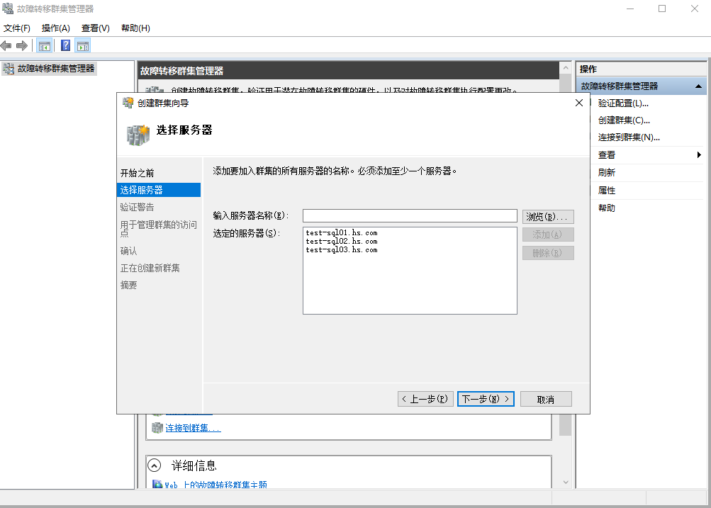
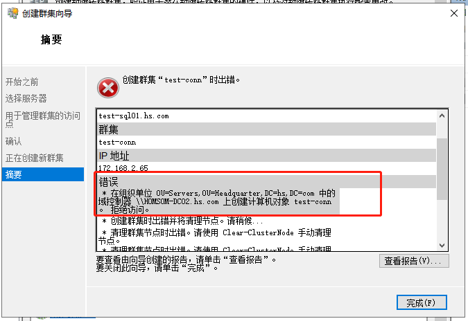
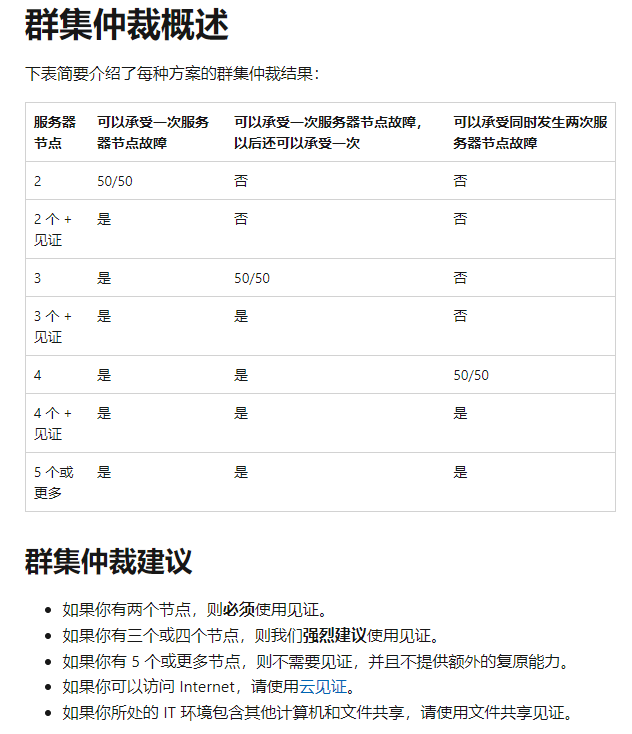
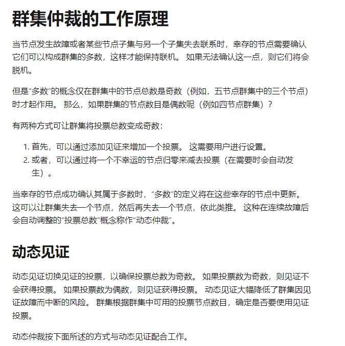
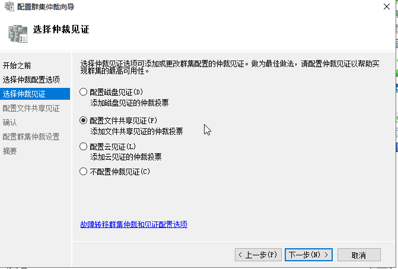
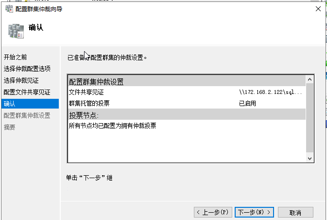
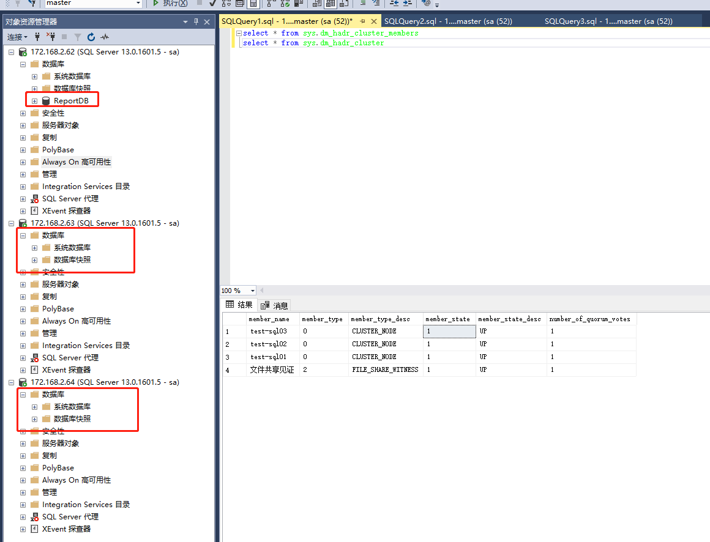
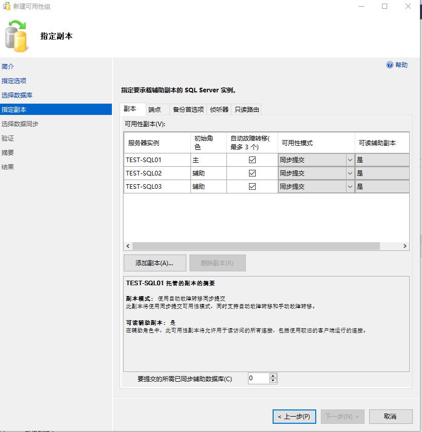

# sqlserver 2016 always-on cluster deploy


## 环境

* server01: 
  * os: windows server 2019 datacenter
  * sqlserver: 2016 enterprise
  * hostname: test-sql01
  * ip: 172.168.2.62

* server02: 

  * os: windows server 2019 datacenter

  * sqlserver: 2016 enterprise
  * hostname: test-sql02
  * ip: 172.168.2.63

* server03: 

  * os: windows server 2019 datacenter

  * sqlserver: 2016 enterprise
  * hostname: test-sql03
  * ip: 172.168.2.64

* WSFC集群
  * ip: 172.168.2.65 
  * hostname: test-conn


### 1. 系统部署

---

* 安装windows server 2019 datacenter操作系统
* 配置ip地址、主机名、加域
* hs\test-sql2016登入系统，此用户已加入本地管理员组administrators{将用户hs\test-sql2016加入到domain admins组中，此用户需要域管理员权限，因为在使用WSFC时需要在AD中创建对象，否则创建群集将会失败}


### 2. 安装sqlserver 2016

---

* 每台节点正常安装sqlserver 2016 enterprise实例，是单实例安装，不是集群模式安装
* 安装前关闭windows防火墙
* "数据库引擎服务" --> "针对外部数据的Polybase查询服务"、"R服务(数据库内)", "analysis services"、"reporting services"不要勾选，"共享功能" --> "R Server(独立)"、"Reporting Services - SharePoint"、"用于SharePoint产品的Reporting Service外接程序"、"Distributed Replay控制器"、"Distributed Replay客户端" 、其它勾选安装
* 身份验证模式为：混合模式，添加当前用户hs\test-sql2016 为 sqlserver管理员 
* 安装完成后，安装SSMS客户端，从2016需要单独下载安装才行，SSMS安装完成后重启服务器
* 每个节点安装好后需要为 MSSQLSERVER实例服务、SQLServer代理服务 配置当前登录的管理员帐户(hs\test-sql2016)进行登录，并重启服务，使2个服务有本地管理员权限


### 3. 安装与配置故障转移集群管理器

---

* 服务器管理器 --> 添加功能和角色 --> 添加功能 --> "故障转移群集"，test-sql01、test-sql02、test-sql03三个节点都需要安装，安装完成生重启服务器生效

* 配置故障转移集群管理器，新建一个群集，将test-sql01、test-sql02、test-sql03三个服务器节点加入集群

  




注：此图报错，原因为hs\test-sql2016用户未有创建AD中对象的权限，所以报错，需要将此用户加入到"domain users"中，从而有创建对象的权限


注：此图为已成功创建群集截图


* URL: [了解 Azure Stack HCI 和 Windows Server 群集上的群集和池仲裁 - Azure Stack HCI | Microsoft Learn](https://learn.microsoft.com/zh-cn/azure-stack/hci/concepts/quorum)






* 配置仲裁，我们有3个节点，可以承受一个节点故障，但是第二次节点再故障将会脑残，为了可以容忍二次节点故障，可以配置仲裁，这样就可以容忍二次节点故障了，就是图上的："3个 + 见证"，为了方便，我们这里面配置"共享仲裁"

  

  

  

  


### 4. 开启AlwaysOn高可用功能

* 3个节点都需要开启AlwaysOn高可用功能，并重启sqlserver服务生效


### 5. 配置AlwaysOn

* 配置AlwaysOn可用性组前，需要先完全备份将要运行在always-on分布式集群中的数据库，例如ReportDB数据库("ReportDB_20221002020001_full.bak")

  * 在主要服务器上恢复数据库，主要数据库必须是RCOVERY状态
  * 在副本服务器上恢复数据库，副本数据库必须是NORECOVERY状态。如果有多个副本数据库，则多个副本数据库都要执行恢复操作，而且必须是NORECOVERY状态

  ```
  -- 还原完整备份172.168.2.62，状态为RCOVERY
  use master
  go
  
  create database ReportDB
  go
  -- RESTORE FILELISTONLY FROM DISK = N'C:\software\ReportDB_20221002020001_full.bak'
  
  RESTORE DATABASE ReportDB
  FROM
  DISK='C:\software\ReportDB_20221002020001_full.bak'
  WITH MOVE 'ReportDB' TO 'C:\TempDb\ReportDB.mdf',
  MOVE 'ReportDB_log' TO 'C:\TempDb\ReportDB_log.ldf',
  STATS = 10, REPLACE,RECOVERY
  GO
  
  
  -- 还原完整备份172.168.2.63，状态为NORCOVERY
  use master
  go
  
  create database ReportDB
  go
  
  RESTORE DATABASE ReportDB
  FROM
  DISK='C:\software\ReportDB_20221002020001_full.bak'
  WITH MOVE 'ReportDB' TO 'C:\TempDb\ReportDB.mdf',
  MOVE 'ReportDB_log' TO 'C:\TempDb\ReportDB_log.ldf',
  STATS = 10, REPLACE,NORECOVERY
  GO
  
  
  -- 还原完整备份172.168.2.62，状态为NORCOVERY
  use master
  go
  
  create database ReportDB
  go
  
  RESTORE DATABASE ReportDB
  FROM
  DISK='C:\software\ReportDB_20221002020001_full.bak'
  WITH MOVE 'ReportDB' TO 'C:\TempDb\ReportDB.mdf',
  MOVE 'ReportDB_log' TO 'C:\TempDb\ReportDB_log.ldf',
  STATS = 10, REPLACE,NORECOVERY
  GO
  ```

  


* 在AlwaysOn高可用性菜单上右键选择  --> "新建可用性组向导"

* 配置一个可用性组名称"test-sql"，群集类型是 "Windows Server故障转移群集"

  

* 下一步后，选择前面恢复的数据库名称


* 下一步，添加其它2个副本，勾选所有 "自动故障转移(最多3个)的勾"，可用性模式为 "同步提交"，可读辅助副本配置：主要节点和辅助节点都为 "否"



* 配置端点，端点URL使用IP地址，不使用DNS名称


* 添加一个侦听器，侦听器名称为："test-sqlconn"、端口、IP地址，网络IP地址为局域网内空闲IP{此IP以后提供读写功能的数据库实例地址}

